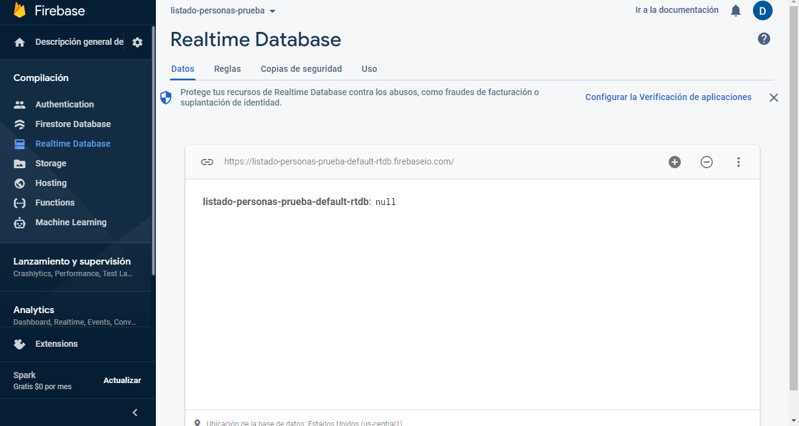

# Listado Personas en Angular

Este proyecto se va desarrollando a lo largo del curso [Universidad Angular](https://www.udemy.com/course/angular-de-cero-a-experto-angular-2-framework-javascript-html-css/).

Se trata de una sencilla aplicación que agrega personas a una lista, permite su edición y eliminación. Como _backend_ se utilizó _firebase_ y como _hosting_ de alojamiento, igualmente se utilizó _firebase_.

El objetivo fue poner en práctica a lo largo de los vídeos los conceptos que se iban enseñando.

Este proyecto fue generado con [Angular CLI](https://github.com/angular/angular-cli) version 13.0.4.

## Resultado final del proyecto

### Enlace a la aplicación en vivo

https://esdjl-listado-personas-angular.web.app/login

Datos de acceso:

- Email: prueba@prueba.com
- Contraseña: 123456


## Tecnologías utilizadas

- Angular 13
- SCSS
- Firebase

## Cómo realizar modificaciones

- Clona el repositorio:

```
git clone https://github.com/ESaulDJLaguna/estudio-ListadoPersonasAngular.git
```

- Acceder a la carpeta generada:

```
cd estudio-ListadoPersonasAngular/
```

- Instala las dependencias:

```
npm install
```

---

### Pasos previos antes de ejecutar el servidor de Angular

Antes de poder probar el proyecto, se requiere hacer algunas modificaciones en algunos archivos, así como la creación de la base de datos en _firebase_ y el usuario para autenticarse en la aplicación.

1. Accede a la [consola de firebase](https://console.firebase.google.com/) y da clic en el botón _Crear un proyecto_.


2. Elige un nombre para el proyecto y acepta los términos y condiciones.


3. Elige activar _Google Analytics_ (es opcional).


4. Elige país de origen y crea el proyecto.


5. Una vez que ya se ha creado el proyecto, accede a la opción _Realtime Database_ del menú desplegable del lado izquierdo en la sección _Compilación_ y da clic en el botón _Crear una base de datos_.


6. En la ventana desplegable que sale, elige Estados Unidos y da clic en _Siguiente_. Elige _Comenzar en modo prueba_ y da clic en _Habilitar_.


7. Una vez que se creó la base de datos, dará una _url_, esta será la que se utilizará para hacer peticiones al servidor. Hay que copiarla para utilizarla a continuación.



8. En el proyecto, acceder al archivo _data.services.ts_, en él se encontrarán cuatro métodos con un comentario _TODO_. Debemos sustituir la palabra _URL_ de la cadena `URL/datos...`, con la _url_ que obtuvimos al generar la base de datos en el punto anterior.

9. Además, en _Realtime Database_ en la parte superior donde dice _Reglas_, debemos sustituir las que están actualmente por las siguientes:

```json
{
  "rules": {
    ".read": "auth != null", // 2022-1-20
    ".write": "auth != null" // 2022-1-20
  }
}
```


10. En la parte de _Authentication_, dar clic en el botón _Comenzar_.


11. A continuación, elegir el tipo de autenticación, en este proyecto solo se utiliza _Correo electrónico/contraseña_.


12. En la nueva ventana que aparece, habilitar la primer opción y dar clic en el botón _Guardar_.


13. Aquí mismo en _Authentication_. En la parte de _Users_, damos clic en el botón _Agregar usuario_, agregamos un correo y una contraseña de al menos 6 caracteres. Estos datos los utilizaremos para loguearse en la aplicación una vez que se ejecute el servidor para iniciar la aplicación.


14. En la pantalla principal del proyecto en _'Agrega una app para comenzar'_, damos clic en la tercer opción (Web).


15. Elegimos un sobrenombre y damos clic en _Registrar app_. A continuación, nos dará las instrucciones para agregar el _SDK de Firebase_, de todo eso lo que debemos copiar es el objeto _firebaseConfig_ (solo el contenido entre las llaves).

```ts
const firebaseConfig = {
  apiKey: "XXXXXXXXXX",
  authDomain: "XXXXXXXXXX",
  databaseURL: "XXXXXXXXXX",
  projectId: "XXXXXXXXXX",
  storageBucket: "XXXXXXXXXX",
  messagingSenderId: "XXXXXXXXXX",
  appId: "XXXXXXXXXX",
  measurementId: "XXXXXXXXXX",
};
```


16. Nos dirigimos a nuestro proyecto, dentro de la carpeta _environments_ abrimos los dos archivos que hay y sustituimos el contenido de la variable _firebase_ con lo que copiamos en la parte anterior.

17. En los archivos _.firebaserc_ y _angular.json_, se debe sustituir todo lo que diga `esdjl-listado-personas-angular` por el nombre que se le dio al proyecto en el punto número 2, en este ejemplo es `listado-personas-prueba`. Si no se hace, al tratar de subir la aplicación al _hosting_ de _firebase_ marcará un error.

---

- Una vez que se realizaron todos los pasos previos, se puede ejecutar el servidor de angular con la siguiente instrucción:

```
ng serve
```

- En un navegador, escribir la ruta `http://localhost:4200/`. La aplicación se actualizará automaticamente cada vez que haya un cambio en el código fuente.

## Desplegar la aplicación en Internet

- Compilamos la aplicación _Angular_ con el siguiente comando. Lo cual generará una carpeta llamada `dist/`:

```
ng build
```

- En nuestro proyecto en [firebase](https://console.firebase.google.com/), en la parte de _Hosting_, damos clic en el botón _Comenzar_. Los comandos a partir de la instalación de _Firebase CLI_ deben hacerse en la raíz del proyecto:

- Instalmos _Firebase CLI_:

```
npm install -g firebase-tools
```

- Accedemos a la cuenta de _Google_:

```
firebase login
```

- Iniciamos el proyecto

```
firebase init
```

- Cuando pida elegir las características que queremos, debemos elegir `Realtime Database` y `Hosting` (de _firebase_ no el de _GitHub_). Cuando nos pida elegir el directorio (public) que queremos subir, escribirmos `dist`, que es la carpeta que se generó al compilarse el proyecto.

- Una vez hecho lo anterior, vamos al archivo _firebase.json_ y modificamos `"public": "dist",` agregando `/listado-personas-angular`, que es el nombre de la carpeta (dentro de la carpeta _dist_) donde se encuentran todos los archivos que se generaron cuando se compiló la aplicación.

- Finalmente ejecutamos el siguiente comando que subirá la aplicación al _hosting_.

```
firebase deploy
```

- Una vez ejecutado el comando anterior, se crearán dos dominios (en firebase en la sección _Hosting_) con el nombre que utilizamos para crear el proyecto (en el punto 2 de los pasos previos) y las terminaciones `.web.app` y `.firebaseapp.com`. Ambos pueden llevarnos a la aplicación ya desplegada en Internet.

## Code scaffolding

Run `ng generate component component-name` to generate a new component. You can also use `ng generate directive|pipe|service|class|guard|interface|enum|module`.

## Running unit tests

Run `ng test` to execute the unit tests via [Karma](https://karma-runner.github.io).

## Running end-to-end tests

Run `ng e2e` to execute the end-to-end tests via a platform of your choice. To use this command, you need to first add a package that implements end-to-end testing capabilities.

## Further help

To get more help on the Angular CLI use `ng help` or go check out the [Angular CLI Overview and Command Reference](https://angular.io/cli) page.
